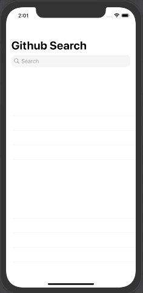

## 3번째 RxSwift 실습
 

> Moya, RxSwift + MVVM 패턴을 활용해 Github API로 유저의 레포지터리 정보를 받아온 후, 화면에 바인딩하는 프로젝트 

 

***개발 환경***
* Xcode 12.2
* Swift
* CocoaPods

 

***라이브러리***
* Moya/RxSwift
* RxSwift
* RxCocoa

 

***실행화면***

