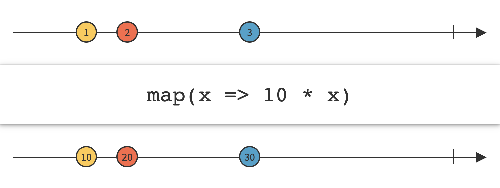
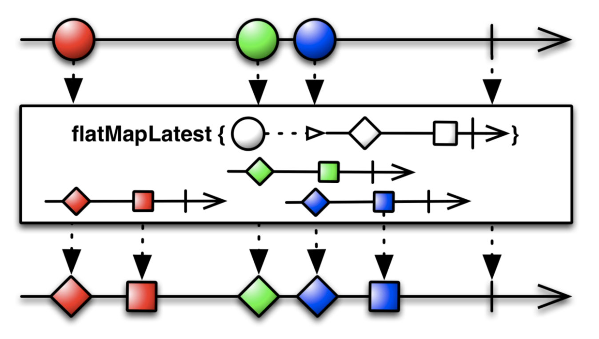
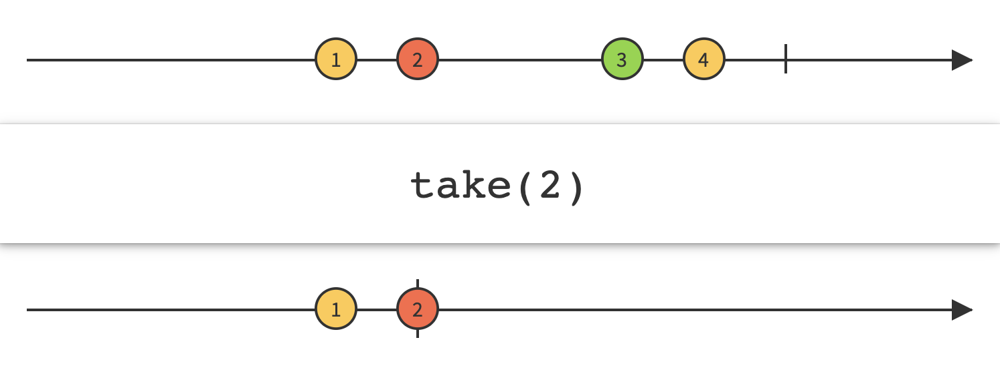
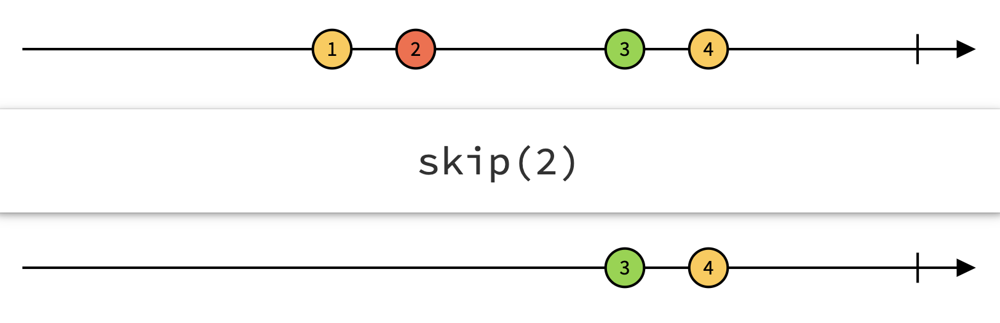
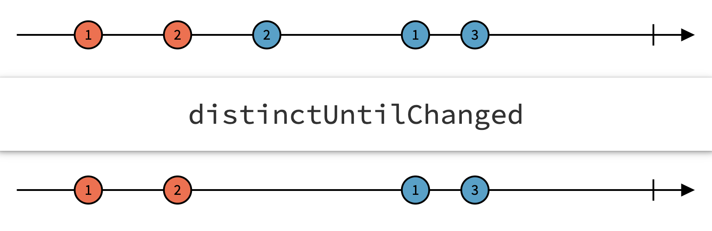
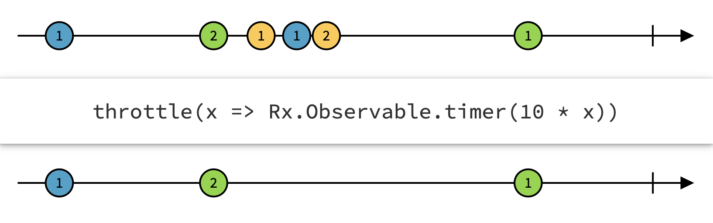

## Operator

***RxSwift Operator란?***

> RxSwift는 Reactive 프로그래밍으로서 비동기 프로그래밍에 대한 실행을 스트림(Stream)으로 보기 용이하고 편리하게 만들어주는 라이브러리이다.
>
> 여기서 Operator들은 이 스트림(Stream)에서 Observable에 의해 방출되는 이벤트들을 자유롭게 지지고 볶고 본인이 원하는 형식으로 변환하여 이벤트에 대응할 수 있게 해주는 것이다.

<br>

오늘 살펴볼 ***Operator***들을 크게 범주를 나누면 3가지로 나눌 수 있습니다.

* Transforming Observables
* Filtering Observables
* Combining Observables

<br>

그럼 카테고리 내에서 자주 사용하는 Operator들을 마블 다이어그램을 통해 보고 어떻게 사용되는지 알아볼게요.

<br>

<br>

#### Transforming Operators

---

1. `map`

   * 방출된 이벤트를 특정 함수를 적용하여 새로운 이벤트로 변형하여 방출시킵니다
   * Swift의 표준함수로 제공되는 `map`과 동일한 역할을 한다고 보면 됩니다.

   

   ```swift
   Observable.just(10)
       .map { $0 * 2 }
       .subscribe(onNext: {
           print($0)
       })
       .disposed(by: disposeBag)
   
   /* Prints:
   20
   */
   ```

   <br>

2. `flatMap`

   * 방출된 이벤트로부터 아예 새로운 `Observable`로 변형해서 방출시킨다.
   * 어려울 수 있는데, 보통 URL로부터 API를 호출해서 새로운 `Observable`을 생성할 때 사용합니다.

   

   ```swift
   func requestAPI(url: String) -> Observable<Data> {
       return Observable.create { ob in
           guard let url = URL(string: url) else {
               ob.onError(NSError(domain: "url error", code: -1, userInfo: nil))
               return Disposables.create()
           }
               
           URLSession.shared.dataTask(with: url) { data, res, err in
               guard let data = data else {
                   ob.onError(NSError(domain: "request error", code: -2, userInfo: nil))
                   return
               }
               ob.onNext(data)
               ob.onCompleted()
           }.resume()
               
           return Disposables.create()
       }
   }
   
   Observable.just("https://api.github.com")
           .flatMap { url -> Observable<Data> in
               return APIService.requestAPI(url: url)
           }
           .subscribe(onNext: { data in
               let decoding = try? JSONDecoder().decode(Int.self, from: data)
               print(decoding)
           })
           .disposed(by: disposeBag)
   
   // 일단은 API를 아무거나 입력을 했는데, 최종적으로 API로부터 불러온 데이터를 디코딩해서 출력해줍니다.
   ```

   <br>

3. `flatMapLatest`

   * 기본적으로는 `flatMap`과 동일하게 작동한다.
   * `flatMap`과 다른 점은 가장 최신의 값만을 다루고 싶을 때 사용하는 Operator이다.

   

   ```swift
   struct Student {
       var score: BehaviorRelay<Int>
   }
   
   let john = Student(score: BehaviorRelay(value: 75))
   let mary = Student(score: BehaviorRelay(value: 95))
   
   let student = PublishSubject<Student>()
           
   student.flatMapLatest { $0.score }
       .subscribe(onNext: {
           print($0)
       }).disposed(by: disposeBag)
           
   student.onNext(john)
   john.score.accept(100)
           
   student.onNext(mary)
   mary.score.accept(80)
           
   john.score.accept(43)
   mary.score.accept(90)
   
   /* Prints:
   75 john
   100 john
   95 mary
   80 mary
   43 john
   90 mary
   */
   
   /* 만약 flatMap을 사용한다면 Prints:
   75 john
   100 john
   95 mary
   80 mary
   90 john
   */
   
   // flatMapLatest의 이 전에 mary로 들어온 Observable 타입은 구독하지 않는다.
   ```

   <br>

   <br>

#### Filtering Operators

---

1. `filter`

   * 방출된 이벤트 중 조건에 맞는 이벤트만 방출시킨다.
   * Swift 표준함수로 제공되는 `filter`와 동일한 역할을 한다.

   

   ```swift
   Observable.from([1, 2, 3, 4, 5, 6, 7, 8])
       .filter { $0 % 2 == 0 }
       .subscribe(onNext: {
           print($0)
       })
       .disposed(by: disposeBag)
   
   /* Prints:
   2 
   4
   6
   8
   */
   ```

   <br>

2. `take`

   * 처음으로 들어오는 n개의 이벤트만 방출합니다.

   

   ```swift
   Observable.from([1, 2, 3, 4, 5, 6, 7, 8])
       .take(2)
       .subscribe(onNext: {
           print($0)
       })
       .disposed(by: disposeBag)
   
   /* Prints:
   1
   2
   */
   ```

   <br>

3. `skip`

   * 처음 방출되는 n개의 이벤트는 넘어가고 이후 이벤트부터 방출합니다.

   

   ```swift
   Observable.from([1, 2, 3, 4, 5, 6, 7, 8])
       .skip(2)
       .subscribe(onNext: {
           print($0)
       })
       .disposed(by: disposeBag)
   
   /* Prints:
   3
   4
   5
   6
   7
   8
   */
   ```

   <br>

4. `distinctUntilChanged`

   * 연속으로 같은 값이 방출되는 것을 막아준다.

   

   ```swift
   Observable.from([1, 2, 3, 3, 4])
       .distinctUntilChanged()
       .subscribe(onNext: {
           print($0)
       })
       .disposed(by: disposeBag)
   
   /* Prints:
   1
   2
   3
   4
   */
   ```

   <br>

5. `throttle`

   * 지정한 시간동안 처음 들어오는 이벤트를 방출한다.
   * `latest`라는 변수에 어떤 값을 할당하냐에 따라 다른 이벤트가 발생한다. 밑의 그림은 `latest` 변수에 false를 할당한 경우다. true를 할당할 경우 처음의 이벤트와 지정한 시간 후의 가장 최신의 이벤트를 방출한다.

   

   <br>

6. `debounce`

   * 지정한 시간동안 들어온 이벤트 중 가장 최신의 이벤트만 방출한다.

   

<br>

<br>

#### Combining Operators

---

1. `concat`


