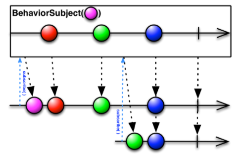
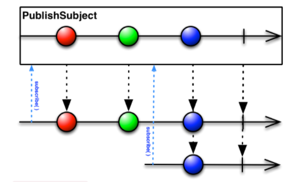
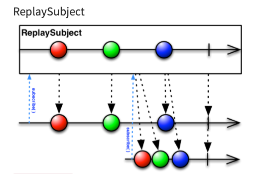

## Subject

<br>

***Subject란?***

이전에 나왔던 `Observable`의 개념과 헷갈렸는데, ***Subject***는 `Observable`과 `Observer`의 역할을 모두할 수 있는 객체입니다. 그리고 하나의 큰 차이라고 생각했던 부분이 있다. `Observable`의 경우 보통 한 번 생성해서 `Observer`가 구독해서 사용하는 방식인데, ***Subject***의 경우는 여러개의 `Observer`가 이를 구독해서 사용하는 것이 가능하다는 것이다.

그리고 다른 블로그를 보며 차이를 느낄 수 있었던 좋은 예제가 있었는데, 이를 보면 ***Subject***와 `Observable`의 큰 차이를 쉽게 확인할 수 있다.

> **Observable**

```swift
// Observable 생성
let generator = Observable<Int>.create { ob in 
 ob.onNext(Int.random(in: 0...100))
 ob.onCompleted()
 return Disposables.create()
}

// Observable 구독
generator.subscribe(onNext: { ranNum in
  print("ob1: \(ranNum)")
})

generator.subscribe(onNext: { ranNum in
 print("ob2: \(ranNum)")
})

// ob1 : 35
// ob2 : 15
```

<br>

> **Subject**

```swift
// Subject 생성
let generator = BehaviorSubject(value: 10)
generator.asObserver()
	.onNext(Int.random(in: 1...100))

// Subject 구독
generator.asObservable()
	.subscribe(onNext: { ranNum in 
    print("ob1 : \(ranNum)")
 	})

generator.asObservable()
	.subscribe(onNext: { ranNum in
    print("ob2 : \(ranNum)")
  })

// ob 1 : 49
// ob 2 : 49
```

<br>

위의 자료를 보면 알 수 있는 것이 `Observable`의 경우에는 각각의 `subscribe`가 실행되는 당시에 새로운 이벤트를 생성해서 전달하는 반면 ***Subject***의 경우에는 하나의 흐름을 구독해서 모두가 동일한 값을 전달받는다.

`Observable` : 구독하는 순간부터 새롭게 모든 이벤트를 받을 수 있다

`Subject` : 구독하는 순간부터의 이벤트를 전달받을 수 있다.

<br>

***두 가지의 사용을 언제 할 수 있을까?***

`Observable` : 단일한 이벤트에 대해 각각 반응해야 할 경우

`Subject` : 하나의 이벤트에 대해 여러개가 관찰해야할 경우, 데이터가 자주 변하고 저장되어야 할 때

 <br>

---

#### Subject Type

대표적으로 3가지의 Subject가 존재한다.

* BehaviorSubject
* PublishSubject
* ReplaySubject

<br>

이제 각각의 Subject에 대해 어떤 역할을 가지고 어떤 흐름을 가지는지 살펴보자.

**BehaviorSubject**

> 우선 BehaviorSubject는 생성될 때, 초기의 값을 가지고 생성이 되어진다. 그리고 subscibe을 실행하게 되면, 발생한 시점 이전에 발생한 이벤트 중 가장 최신에 해당하는 이벤트를 받는다.




<br>

**PublishSubject**

> BehaviorSubject와는 다르게 초기의 값이 존재하지 않는다. 그리고 subscribe을 실행하게 되면, 발생한 시점부터 이후에 전달된 이벤트만을 전달받는다. 만약 그 이전에 전달된 이벤트가 있을 경우 무시한다.



<br>

**ReplaySubject**

> 이 경우에는 Buffer Size라는 것이 존재하는데 최신 이벤트를 Buffer Size만큼 가지고 있다가 subscribe가 되면 그 순간 한 번에 이 데이터들을 전달한다.



<br>

이렇듯 Subject 레퍼런스들이 존재하고 각 역할에 맞게 사용하는게 좋을 것 같다.

